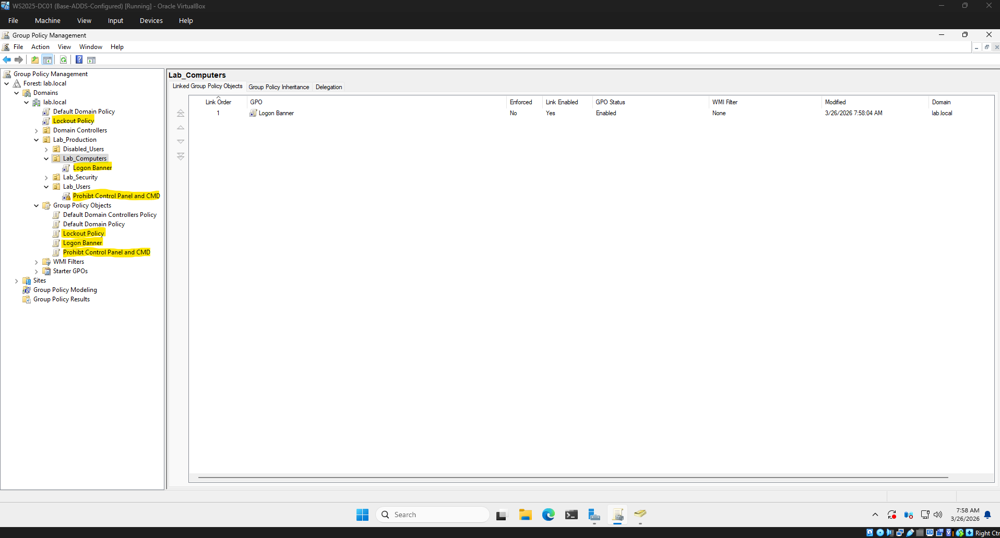

# IT Support Lab Series  

## Contact & Connect  
The best way to contact me is via [LinkedIn](https://www.linkedin.com/in/patrickbobbitt/). For technical inquiries regarding my labs, feel free to open an issue.

  &nbsp;

## Education & Certifications

</a>       

## Lab Series Technical Stack  

  
  
  
  
  
  
  
  
  

## Project Overview
This repository contains a comprehensive, three-part technical lab series simulating a real-world enterprise IT environment. The project moves from raw infrastructure deployment to advanced Identity and Access Management (IAM), concluding with a hands-on Help Desk ticketing simulation.

**The Goal:** To build, secure, and manage a corporate network from the ground up, demonstrating proficiency in systems administration, network security, and technical support workflows.

## Core Tech Stack & Competencies
*   **Operating Systems:** Windows Server 2025 (Datacenter), Windows 11 Enterprise
*   **Directory Services:** Active Directory Domain Services (AD DS)
*   **Networking:** DNS, DHCP, Static IPv4 Addressing, NAT Networking
*   **Security & Policy:** Group Policy Objects (GPO), RBAC (Role-Based Access Control), Least Privilege, Account Lockout Policies
*   **Virtualization:** Oracle VirtualBox (Type-2 Hypervisor)
*   **IT Operations:** Disaster Recovery (Snapshots), Documentation, Troubleshooting
*   **Scripting:** PowerShell

## Project Structure

### [Part 1: Windows Server & Infrastructure Build](./part-1-infrastructure/)
**Focus: The Foundation.** 
*   Architected an isolated virtual network environment.
*   Deployed **Windows Server 2025** as a Primary Domain Controller.
*   Provisioned a Windows 11 managed endpoint.
*   **Key Outcome:** A fully functional, stable environment with verified internal/external connectivity and disaster recovery fail-safes.

&nbsp;

### [Part 2: Identity & Access Management (Active Directory/GPO)](./part-2-active-directory/)
**Focus: Security & Governance.**
*   Designed a scalable **Organizational Unit (OU)** hierarchy.
*   Implemented **Role-Based Access Control (RBAC)** for HR, Finance, and IT departments.
*   Deployed **Group Policy Objects (GPOs)** to harden endpoints (restricting CMD/Control Panel) and enforce corporate compliance.
*   Automated **User Provisioning at Scale**: Built a PowerShell-driven onboarding process to create and assign 100 user accounts from a CSV file.
*   Validated **Security & System Integrity**: Conducted end-to-end testing (permissions, GPOs, resource limits), ensuring policies work as intended.
*   **Key Outcome:** A fully automated and policy-driven domain where user access, security controls, and resource provisioning are consistently enforced, reducing manual IT workload and significantly reducing the attack surface, and ensuring every employee is set up correctly from day one.

&nbsp;&nbsp;&nbsp;

### [Part 3: Help Desk Operations & Ticketing](./part-3-hybrid-cloud-integration/) *(In Progress)*
**Focus: Bridge the gap between the on-premises Domain Controller and the Microsoft 365 ecosystem.**
*   Streamlined secure access for 100 users and 3 departments by implementing a Hybrid Identity environment using Microsoft Entra Connect, achieving 100% successful synchronization to Entra ID and enabling seamless Single Sign-On (SSO) capabilities.
*   Eliminated cloud authentication blockers for 100 local accounts by configuring alternative UPN Suffix routing, successfully mapping a private local network to a fully verified, publicly routable Microsoft 365 Enterprise cloud domain.
*   Automated remote device provisioning for Windows 11 endpoints by deploying Configuration Profiles using Microsoft Intune, eliminating manual IT setups and instantly enforcing corporate web policies over the internet for targeted departments.
*   Unblocked cloud enrollment and prevented system downtime across the server environment by resolving critical M365 licensing errors and local GPO lockouts, ensuring a 100% success rate for targeted hybrid-join workstation registrations.
  
### [Part 4: Help Desk Operations & Ticketing](./part-4-helpdesk-tickets/) *(In Progress)*
**Focus: The User Experience.**
*   Simulating real-world L1/L2 support scenarios.
*   Resolving common issues: Password resets, software deployment, and policy troubleshooting.
*   Utilizing ticketing workflows to document and track "Break/Fix" incidents.
*   **Key Outcome:** Demonstrating the ability to translate technical knowledge into professional end-user support.

## Key Technical Highlights

### Enterprise-Scale Automation
* Automated the creation and security group assignment of 100+ user accounts using a custom PowerShell script, reducing a multi-hour onboarding task to just minutes and eliminating manual errors.

### Security Hardening
* Deployed automated security policies to enforce **Principle of Least Privilege (PoLP)**, I ensured that standard users cannot access system-level tools, while "IT Support" users maintain the access needed to perform their duties.

### Automated Resource Provisioning
* Deployed Group Policies to automatically map departmental network drives (S:) and deploy shared printers, providing employees with instant, zero-touch access to essential tools upon login.

### Efficient Storage Management
*  Implemented FSRM to enforce storage quotas and block unauthorized file types (e.g., audio/video), preventing waste and ensuring critical disk space remains available for business operations.

  
### Troubleshooting & Resilience
Throughout this lab, I resolved critical "low-level" conflicts, including:
*   **Hypervisor Optimization:** Solving "Black Screen" boot errors by managing Hyper-V/Core Isolation conflicts at the host firmware level.
*   **Network Logic:** Rectifying authentication errors caused by VM mismatches, proving a methodical approach to the OSI model.
*   **Permission Misconfiguration:** Identified and corrected inherited NTFS/share permission conflicts that unintentionally granted Finance access to all departments.
*   **GPO & Print Deployment Failure:** Troubleshot a failed network printer deployment caused by incorrect GPO pathing, driver issues, and client security restrictions; rebuilt the printer using a compatible driver and corrected FQDN configuration to restore functionality.
*   **Policy Validation & Debugging:** Used tools like gpupdate and manual connection testing to systematically isolate failures and confirm successful policy enforcement across user environments.
  
### Documentation & Governance
Each phase of this project includes a detailed **Implementation Log**. I treat these logs as professional internal documentation, ensuring that every configuration change is auditable and repeatable, a vital skill in any enterprise IT team.

## Disclaimer & AI Disclosure
While 100% of the technical implementation and verification within this environment was conducted by the author, Generative AI was employed to assist in structuring the final report and ensuring professional terminology standards were met throughout the documentation.
