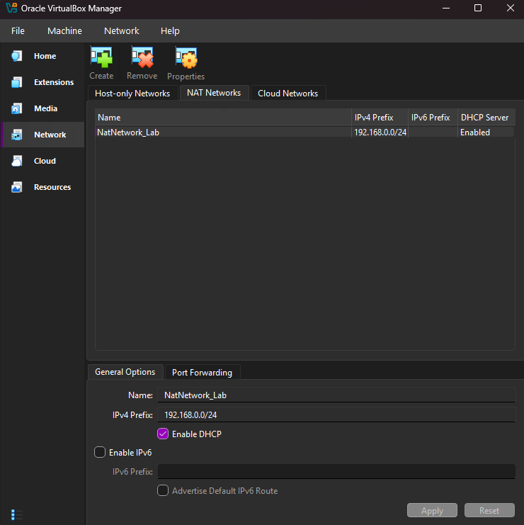

# Part 1: Infrastructure Setup

## Objective
Set up a fully functional Windows domain environment with a domain controller and client machine to simulate a professional corporate network.

## Environment
- Windows Server 2025 (Domain Controller)
- Windows 11 Education (Client)
- Oracle VirtualBox
- Virtual Network (NAT Network: 192.168.0.0/24)

## Key Tasks
- **Hardware & Resource Planning**
  - Performed a system audit using `msinfo32` to ensure hardware could support multiple virtual machines, allocating 8 GB RAM and 4 CPU Processors to the project.
- **Virtual Network Configuration**
  - Created a dedicated isolated network (`NatNetwork_Lab`) with DHCP enabled to allow secure communication between the domain controller and the client.
- **Domain Controller Deployment (Active Directory)**
  - Installed Windows Server 2025 and promoted it to a Domain Controller for the `lab.local` forest, establishing the foundation for centralized identity management.
- **Network Services Setup (DNS & IPv4)**
  - Configured static IPv4 addressing and DNS settings to ensure the client machine could reliably locate and communicate with the server.
- **Client Integration & Domain Join**
  - Provisioned a Windows 11 workstation and successfully joined it to the `lab.local` domain, verifying the connection through Active Directory Users and Computers (ADUC).
- **Proactive Troubleshooting & Optimization**
  - Resolved virtualization conflicts (Hyper-V interference) and implemented a Snapshot strategy to ensure environment stability and quick recovery.

## Outcome
A working domain environment capable of centralized authentication and management, mimicking a real-world enterprise IT infrastructure.

## Key Takeaways
- **Centralized Administration**
  - Learned how to create virtual machine instances and set up an Active Directory server, a critical skill for L1 support.
- **Networking Foundations**
  - Gained hands-on experience with **IPv4 and DNS**, ensuring seamless connectivity between enterprise devices.
- **Critical Problem Solving**
  - Successfully diagnosed and fixed system-level errors (Hyper-V/Core Isolation) to ensure software compatibility and performance with the host device.
- **Disaster Recovery Basics**
  - Utilized **Snapshots** to create "restore points," demonstrating an understanding of system backups and minimizing downtime.
 
## Troubleshooting Log

| Issue Encountered | Root Cause Analysis | Resolution & Verification |
| :--- | :--- | :--- |
| On first run of [VM](Images/networking%20missing.png) couldn't find "network" under `Files>Tools`   | VM [preferences](Images/Preferences%20set%20as%20basic.png) were set to basic | Changed VM [preference](Images/networking%20is%20now%20listed.png) to expert and "networks" appeared under `Files>Tools>network` |
| [VM Boot Failure / Black Screen](Images/VM%20Black.png) | Hyper-V / Core Isolation enabled on Host (Warning is Green Turtle icon)| Disabled Hyper-V via [bcdedit](https://github.com/pbobbitt/Windows-Server-2025-Virtual-Infrastructure-Deployment/blob/main/Images/Disabled%20Hyper-V%20bootloader.png) and toggled off [Memory Integrity](Images/Disabled%20Memory%20Integrity.png) to allow VirtualBox native VT-x/AMD-V access. Confirmed [VirtualBox now runs](Images/VM%20Working.png) |

## Screenshots
- Host System Info Hardware Verification

 
- Network Settings for Virtual Lab Network `NatNetwork_Lab`

- Domain Controller `WS2025-DC01` Active Directory setup & DNS Confirmation

- Client `W11-CL01` Domain Join Success to `lab.local` forest

  
- Post Lab Snapshots for System Recovery Points

